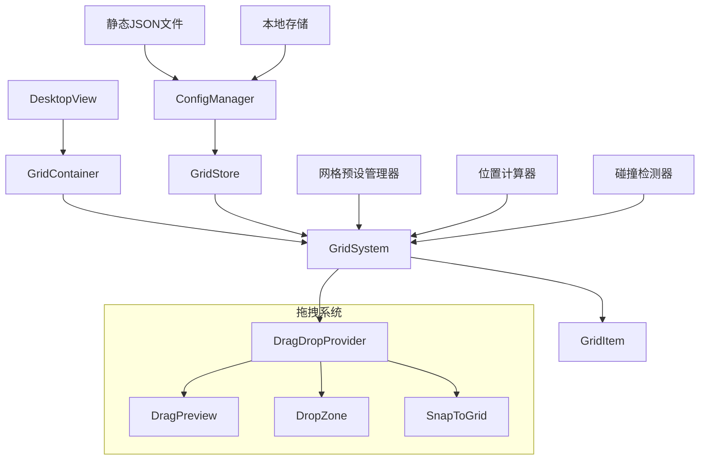
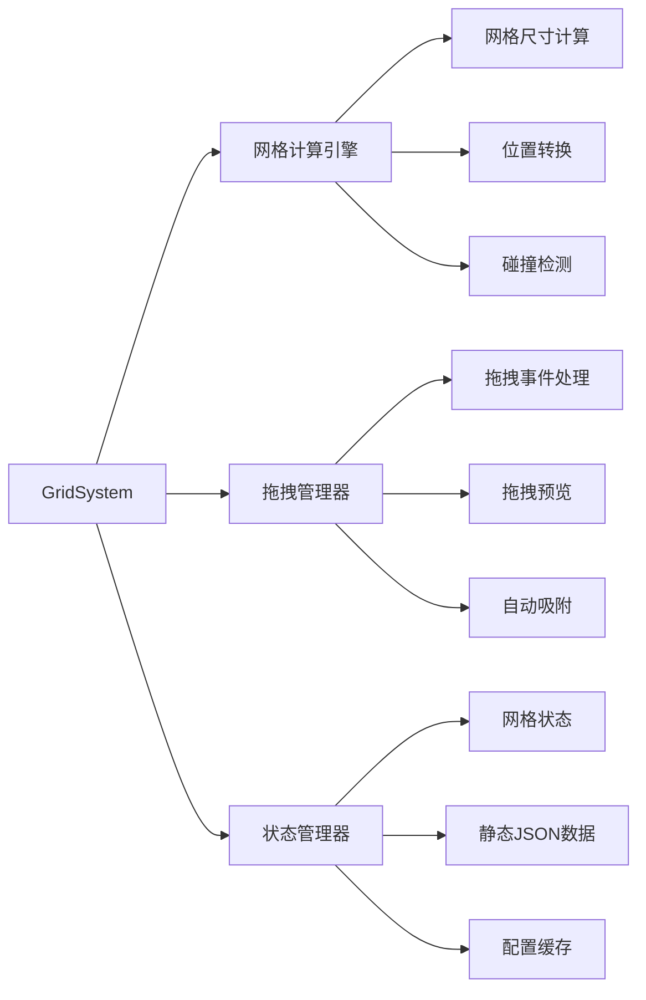
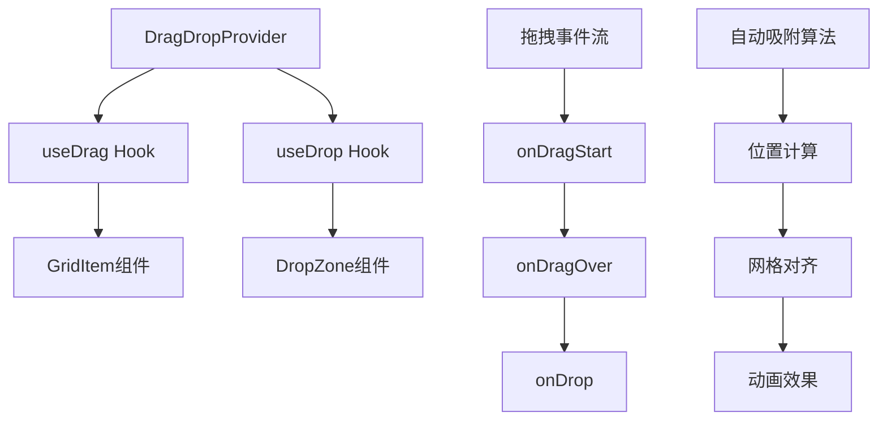

# 桌面网格系统实现设计

## 概述

为玲珑OS桌面系统实现网格化布局管理功能，提供灵活的图标排列和拖拽交互体验。系统支持多种网格预设（大、中、小），通过JSON配置文件进行应用内容管理，并集成vue3-dnd实现拖拽功能。

## 技术栈与依赖

### 现有技术栈

- **Vue 3**: 组合式API、响应式系统
- **TypeScript**: 类型安全
- **Pinia**: 状态管理
- **Vue Router**: 路由管理
- **Tailwind CSS**: 样式框架
- **Radix Vue**: UI组件库

### 新增依赖

- **@formkit/vue-dnd**: Vue 3拖拽库（https://www.vue3-dnd.com/）
- **lodash-es**: 工具函数库（深拷贝、防抖等）

## 架构设计

### 网格系统架构图



### 核心组件架构



## 数据模型设计

### 核心数据类型

``typescript
// 网格配置类型
interface GridConfig {
id: string
name: string
gridSize: GridSize
cellSize: number
gap: number
columns: number
rows: number
padding: Padding
}

// 网格尺寸预设
type GridSize = 'small' | 'medium' | 'large'

// 网格项目类型
interface GridItem {
id: string
appId: string
type: 'apps' | 'files' // apps 应用、files 文件
position: GridPosition
general: GridItemGeneral
data: Record<string, any> // 桌面应用的补充参数
metadata: GridItemMetadata
}

// 网格位置（用于计算和拖拽）
interface GridPosition {
x: number // 网格列索引
y: number // 网格行索引
}

// 网格项目通用配置
interface GridItemGeneral {
locked: boolean // 是否锁定位置
visible: boolean // 是否可见
}

// 网格项目元数据
interface GridItemMetadata {
create_time: string // 创建时间戳
ext_name?: string // 扩展名（文件类型时使用）
open_mode: string // 打开方式标识
}

// 桌面应用信息
interface DesktopApp {
id: string
name: string
icon: string
description?: string
category?: string
executable?: string
}

// 桌面配置
interface DesktopConfiguration {
version: number
gridConfig: GridConfig
apps: DesktopApp[]
items: GridItem[]
theme: ThemeConfig
wallpaper?: string
lastModified: number
}

```

### 网格预设配置

| 预设大小 | 图标尺寸 | 网格间距 | 默认列数 | 适用场景 |
|----------|----------|----------|----------|----------|
| 小 (Small) | 48x48px | 8px | 16 | 密集排列，最大化利用空间 |
| 中 (Medium) | 64x64px | 12px | 12 | 平衡视觉效果和空间利用 |
| 大 (Large) | 80x80px | 16px | 10 | 清晰视觉，适合触屏操作 |

**注意**: 所有桌面图标保持统一尺寸，每个图标占用一个网格单元格。

## 组件架构

### 1. GridContainer 容器组件

**职责**: 网格系统的根容器，管理整体布局和响应式调整

**核心功能**:
- 响应式网格尺寸调整
- 容器尺寸监听和重新计算
- 网格背景渲染
- 全局拖拽状态管理

### 2. GridSystem 核心组件

**职责**: 网格逻辑的核心实现，负责网格计算和状态管理

**核心功能**:
- 网格布局计算
- 位置坐标转换
- 碰撞检测算法
- 空位查找算法

### 3. GridItem 网格项组件

**职责**: 单个网格项的渲染和交互

**核心功能**:
- 应用图标渲染
- 拖拽句柄绑定
- 选中状态显示
- 右键菜单集成

### 4. DragDropProvider 拖拽提供器

**职责**: 集成vue3-dnd，提供拖拽功能

**核心功能**:
- 拖拽源配置
- 拖拽目标配置
- 拖拽预览自定义
- 拖拽事件处理

## 状态管理架构

### GridStore 网格状态管理

``typescript
// Pinia Store 结构
interface GridState {
  // 网格配置
  currentConfig: GridConfig
  availablePresets: GridConfig[]

  // 应用和网格项目
  availableApps: DesktopApp[]
  gridItems: Map<string, GridItem>
  selectedItems: Set<string>

  // 拖拽状态
  isDragging: boolean
  dragItem: GridItem | null
  dropTarget: GridPosition | null

  // 布局状态
  occupiedPositions: Set<string>
  availablePositions: GridPosition[]
}

// Store Actions
interface GridActions {
  // 配置管理
  setGridConfig(config: GridConfig): void
  switchPreset(size: GridSize): void

  // 数据加载
  loadDesktopData(): Promise<void>

  // 项目管理
  addGridItem(item: GridItem): boolean
  removeGridItem(id: string): void
  moveGridItem(id: string, position: GridPosition): boolean

  // 拖拽处理
  startDrag(item: GridItem): void
  updateDragTarget(position: GridPosition): void
  finalizeDrop(): boolean
  cancelDrag(): void

  // 配置持久化
  saveConfiguration(): Promise<void>
  exportConfiguration(): string
  importConfiguration(json: string): boolean
}

```

## 拖拽系统设计

### vue3-dnd 集成架构



### 拖拽交互流程

1. **拖拽开始**:
   - 记录原始位置
   - 创建拖拽预览
   - 标记占用位置为可用

2. **拖拽过程**:
   - 实时计算目标网格位置
   - 执行碰撞检测
   - 显示放置预览

3. **拖拽结束**:
   - 验证目标位置有效性
   - 执行位置更新
   - 触发自动保存

### 自动吸附算法

``typescript
class GridSnapAlgorithm {
/\*\*

- 计算最佳吸附位置
  \*/
  calculateSnapPosition(
  mousePosition: Point,
  gridConfig: GridConfig
  ): GridPosition {
  // 1. 鼠标位置转换为网格坐标
  const gridX = Math.round(mousePosition.x / (gridConfig.cellSize + gridConfig.gap))
  const gridY = Math.round(mousePosition.y / (gridConfig.cellSize + gridConfig.gap))

  // 2. 边界检查和约束（每个图标占用1x1网格）
  const constrainedX = Math.max(0, Math.min(gridX, gridConfig.columns - 1))
  const constrainedY = Math.max(0, Math.min(gridY, gridConfig.rows - 1))

  // 3. 碰撞检测
  const targetPosition = { x: constrainedX, y: constrainedY }
  if (this.isPositionOccupied(targetPosition)) {
  return this.findNearestAvailablePosition(targetPosition)
  }

  return targetPosition

}
}

```

## JSON配置系统设计

### 配置文件结构

``json
{
  "version": "1.0.0",
  "metadata": {
    "name": "我的桌面配置",
    "description": "个人定制桌面布局",
    "author": "用户名",
    "createdAt": "2024-01-01T00:00:00Z",
    "lastModified": "2024-01-01T12:00:00Z"
  },
  "gridConfig": {
    "id": "default-medium",
    "name": "中等网格",
    "gridSize": "medium",
    "cellSize": 64,
    "gap": 12,
    "columns": 12,
    "rows": 8,
    "padding": {
      "top": 20,
      "right": 20,
      "bottom": 20,
      "left": 20
    }
  },
  "apps": [
    {
      "id": "app-file-manager",
      "name": "文件管理器",
      "icon": "/icons/file-manager.svg",
      "description": "管理文件和文件夹",
      "category": "系统工具"
    },
    {
      "id": "app-terminal",
      "name": "终端",
      "icon": "/icons/terminal.svg",
      "description": "命令行界面",
      "category": "开发工具"
    },
    {
      "id": "app-settings",
      "name": "系统设置",
      "icon": "/icons/settings.svg",
      "description": "配置系统选项",
      "category": "系统工具"
    },
    {
      "id": "app-browser",
      "name": "浏览器",
      "icon": "/icons/browser.svg",
      "description": "网页浏览器",
      "category": "网络工具"
    },
    {
      "id": "app-calculator",
      "name": "计算器",
      "icon": "/icons/calculator.svg",
      "description": "科学计算器",
      "category": "实用工具"
    },
    {
      "id": "app-notepad",
      "name": "记事本",
      "icon": "/icons/notepad.svg",
      "description": "文本编辑器",
      "category": "办公软件"
    }
  ],
  "gridItems": [
    {
      "id": "item-1",
      "appId": "app-file-manager",
      "x": 0,
      "y": 0,
      "locked": false,
      "visible": true,
      "data": {
        "customLabel": "文件",
        "startPath": "/home/user/Documents",
        "viewMode": "list"
      },
      "metadata": {
        "lastUsed": "2024-01-01T12:00:00Z",
        "useCount": 15
      }
    },
    {
      "id": "item-2",
      "appId": "app-terminal",
      "x": 1,
      "y": 0,
      "locked": false,
      "visible": true,
      "data": {
        "startCommand": "ls -la",
        "theme": "dark"
      },
      "metadata": {
        "lastUsed": "2024-01-01T10:30:00Z",
        "useCount": 8
      }
    },
    {
      "id": "item-3",
      "appId": "app-browser",
      "x": 2,
      "y": 0,
      "locked": false,
      "visible": true,
      "data": {
        "startUrl": "https://www.example.com",
        "newTab": true
      },
      "metadata": {
        "lastUsed": "2024-01-01T14:20:00Z",
        "useCount": 25
      }
    },
    {
      "id": "item-4",
      "appId": "app-calculator",
      "x": 0,
      "y": 1,
      "locked": false,
      "visible": true,
      "data": {
        "mode": "scientific"
      },
      "metadata": {
        "lastUsed": "2024-01-01T09:15:00Z",
        "useCount": 3
      }
    },
    {
      "id": "item-5",
      "appId": "app-settings",
      "x": 1,
      "y": 1,
      "locked": true,
      "visible": true,
      "data": {
        "section": "appearance"
      },
      "metadata": {
        "lastUsed": "2024-01-01T16:45:00Z",
        "useCount": 12
      }
    }
  ],
  "theme": {
    "mode": "light",
    "accentColor": "#3b82f6",
    "wallpaper": "/wallpapers/default.jpg"
  }
}
```

### 配置管理器设计

``typescript
class ConfigurationManager {
/\*\*

- 加载静态JSON配置
  \*/
  async loadStaticConfiguration(): Promise<DesktopConfiguration> {
  try {
  // 从静态文件加载配置
  const response = await fetch('/config/desktop-config.json')
  const config = await response.json()
  // 配置验证
  this.validateConfiguration(config)

      return config

  } catch (error) {
  console.error('配置加载失败:', error)
  // 返回默认配置
  return this.getDefaultConfiguration()
  }
  }

/\*\*

- 导入JSON配置
  \*/
  async importConfiguration(jsonString: string): Promise<boolean> {
  try {
  const config = JSON.parse(jsonString)
  // 1. 配置验证
  this.validateConfiguration(config)

      // 2. 版本兼容性检查
      const migratedConfig = this.migrateConfiguration(config)

      // 3. 网格状态更新
      await this.applyGridConfiguration(migratedConfig)

      return true

  } catch (error) {
  console.error('配置导入失败:', error)
  return false
  }
  }

/\*\*

- 导出当前配置
  \*/
  exportConfiguration(): string {
  const config: DesktopConfiguration = {
  version: this.getCurrentVersion(),
  metadata: this.generateMetadata(),
  gridConfig: this.gridStore.currentConfig,
  apps: this.gridStore.availableApps,
  items: Array.from(this.gridStore.gridItems.values()),
  theme: this.themeStore.currentTheme,
  lastModified: Date.now()
  }

  return JSON.stringify(config, null, 2)

}

/\*\*

- 获取默认配置
  \*/
  private getDefaultConfiguration(): DesktopConfiguration {
  return {
  version: 1,
  gridConfig: {
  id: 'default-medium',
  name: '中等网格',
  gridSize: 'medium',
  cellSize: 64,
  gap: 12,
  columns: 12,
  rows: 8,
  padding: { top: 20, right: 20, bottom: 20, left: 20 }
  },
  apps: [],
  items: [],
  theme: {
  mode: 'light',
  accentColor: '#3b82f6'
  },
  lastModified: Date.now()
  }
  }
  }

```

## 静态JSON数据结构

### 完整桌面配置示例

``json
{
  "version": "1.0.0",
  "metadata": {
    "name": "默认桌面配置",
    "description": "玲珑OS默认桌面布局",
    "author": "system",
    "createdAt": "2024-01-01T00:00:00Z",
    "lastModified": "2024-01-01T12:00:00Z"
  },
  "gridConfig": {
    "id": "default-medium",
    "name": "中等网格",
    "gridSize": "medium",
    "cellSize": 64,
    "gap": 12,
    "columns": 12,
    "rows": 8,
    "padding": {
      "top": 20,
      "right": 20,
      "bottom": 20,
      "left": 20
    }
  },
  "apps": [
    {
      "id": "app-file-manager",
      "name": "文件管理器",
      "icon": "/icons/file-manager.svg",
      "description": "管理文件和文件夹",
      "category": "系统工具"
    },
    {
      "id": "app-terminal",
      "name": "终端",
      "icon": "/icons/terminal.svg",
      "description": "命令行界面",
      "category": "开发工具"
    },
    {
      "id": "app-browser",
      "name": "浏览器",
      "icon": "/icons/browser.svg",
      "description": "网页浏览器",
      "category": "网络工具"
    },
    {
      "id": "app-calculator",
      "name": "计算器",
      "icon": "/icons/calculator.svg",
      "description": "科学计算器",
      "category": "实用工具"
    },
    {
      "id": "app-settings",
      "name": "系统设置",
      "icon": "/icons/settings.svg",
      "description": "配置系统选项",
      "category": "系统工具"
    },
    {
      "id": "app-notepad",
      "name": "记事本",
      "icon": "/icons/notepad.svg",
      "description": "文本编辑器",
      "category": "办公软件"
    }
  ],
  "gridItems": [
    {
      "id": "item-1",
      "appId": "app-file-manager",
      "type": "apps",
      "position": {
        "x": 0,
        "y": 0
      },
      "general": {
        "locked": false,
        "visible": true
      },
      "data": {
        "title": "文件管理器",
        "path": "/www/server/panel/home"
      },
      "metadata": {
        "create_time": "1757924473000",
        "ext_name": "",
        "open_mode": "app-file-manager"
      }
    },
    {
      "id": "item-2",
      "appId": "app-terminal",
      "type": "apps",
      "position": {
        "x": 1,
        "y": 0
      },
      "general": {
        "locked": false,
        "visible": true
      },
      "data": {
        "title": "终端",
        "startCommand": "ls -la",
        "theme": "dark"
      },
      "metadata": {
        "create_time": "1757924474000",
        "ext_name": "",
        "open_mode": "app-terminal"
      }
    },
    {
      "id": "item-3",
      "appId": "app-browser",
      "type": "apps",
      "position": {
        "x": 2,
        "y": 0
      },
      "general": {
        "locked": false,
        "visible": true
      },
      "data": {
        "title": "浏览器",
        "startUrl": "https://www.example.com",
        "newTab": true
      },
      "metadata": {
        "create_time": "1757924475000",
        "ext_name": "",
        "open_mode": "app-browser"
      }
    },
    {
      "id": "item-4",
      "appId": "file-document-1",
      "type": "files",
      "position": {
        "x": 0,
        "y": 1
      },
      "general": {
        "locked": false,
        "visible": true
      },
      "data": {
        "title": "项目文档.txt",
        "path": "/home/user/Documents/项目文档.txt",
        "size": 1024
      },
      "metadata": {
        "create_time": "1757924476000",
        "ext_name": "txt",
        "open_mode": "app-notepad"
      }
    },
    {
      "id": "item-5",
      "appId": "file-image-1",
      "type": "files",
      "position": {
        "x": 1,
        "y": 1
      },
      "general": {
        "locked": false,
        "visible": true
      },
      "data": {
        "title": "桌面壁纸.jpg",
        "path": "/home/user/Pictures/桌面壁纸.jpg",
        "size": 2048000,
        "thumbnail": "/thumbnails/desktop-wallpaper.jpg"
      },
      "metadata": {
        "create_time": "1757924477000",
        "ext_name": "jpg",
        "open_mode": "app-image-viewer"
      }
    },
    {
      "id": "item-6",
      "appId": "app-settings",
      "type": "apps",
      "position": {
        "x": 2,
        "y": 1
      },
      "general": {
        "locked": true,
        "visible": true
      },
      "data": {
        "title": "系统设置",
        "section": "appearance"
      },
      "metadata": {
        "create_time": "1757924478000",
        "ext_name": "",
        "open_mode": "app-settings"
      }
    }
  ],
  "theme": {
    "mode": "light",
    "accentColor": "#3b82f6",
    "wallpaper": "/wallpapers/default.jpg"
  }
}
```

### 网格项目操作

``typescript
class GridItemManager {
/\*\*

- 创建应用类型的网格项
  \*/
  createAppItem(
  appId: string,
  position: GridPosition,
  data: Record<string, any> = {}
  ): GridItem {
  return {
  id: this.generateItemId(),
  appId,
  type: 'apps',
  position,
  general: {
  locked: false,
  visible: true
  },
  data: {
  title: data.title || this.getAppName(appId),
  ...data
  },
  metadata: {
  create_time: Date.now().toString(),
  ext_name: '',
  open_mode: appId
  }
  }
  }

/\*\*

- 创建文件类型的网格项
  \*/
  createFileItem(
  filePath: string,
  position: GridPosition,
  fileName: string,
  extName: string,
  openMode: string
  ): GridItem {
  return {
  id: this.generateItemId(),
  appId: this.generateFileId(filePath),
  type: 'files',
  position,
  general: {
  locked: false,
  visible: true
  },
  data: {
  title: fileName,
  path: filePath,
  size: 0 // 需要从文件系统获取
  },
  metadata: {
  create_time: Date.now().toString(),
  ext_name: extName,
  open_mode: openMode
  }
  }
  }

/\*\*

- 更新网格项位置
  \*/
  updateItemPosition(item: GridItem, newPosition: GridPosition): GridItem {
  return {
  ...item,
  position: newPosition
  }
  }

/\*\*

- 切换锁定状态
  \*/
  toggleLocked(item: GridItem): GridItem {
  return {
  ...item,
  general: {
  ...item.general,
  locked: !item.general.locked
  }
  }
  }

/\*\*

- 更新项目数据
  \*/
  updateItemData(item: GridItem, newData: Record<string, any>): GridItem {
  return {
  ...item,
  data: {
  ...item.data,
  ...newData
  }
  }
  }
  }

````

### 数据加载与管理

```typescript
class DesktopDataManager {
  /**
   * 加载桌面数据
   */
  async loadDesktopData(): Promise<DesktopConfiguration> {
    try {
      // 1. 尝试从本地存储加载
      const localConfig = this.loadFromLocalStorage()
      if (localConfig) {
        return localConfig
      }

      // 2. 加载静态JSON配置
      const staticConfig = await this.loadStaticConfiguration()

      // 3. 保存到本地存储
      this.saveToLocalStorage(staticConfig)

      return staticConfig
    } catch (error) {
      console.error('数据加载失败:', error)
      return this.getEmptyConfiguration()
    }
  }

  /**
   * 从本地存储加载
   */
  private loadFromLocalStorage(): DesktopConfiguration | null {
    try {
      const data = localStorage.getItem('desktop-config')
      return data ? JSON.parse(data) : null
    } catch {
      return null
    }
  }

  /**
   * 保存到本地存储
   */
  private saveToLocalStorage(config: DesktopConfiguration): void {
    try {
      localStorage.setItem('desktop-config', JSON.stringify(config))
    } catch (error) {
      console.error('保存到本地存储失败:', error)
    }
  }

  /**
   * 按类型过滤网格项
   */
  filterItemsByType(items: GridItem[], type: 'apps' | 'files'): GridItem[] {
    return items.filter(item => item.type === type)
  }

  /**
   * 按可见性过滤网格项
   */
  filterVisibleItems(items: GridItem[]): GridItem[] {
    return items.filter(item => item.general.visible)
  }

  /**
   * 按锁定状态过滤网格项
   */
  filterLockedItems(items: GridItem[]): GridItem[] {
    return items.filter(item => item.general.locked)
  }
}

## 性能优化策略

### 1. 虚拟化渲染

- **大网格优化**: 当网格项目数量超过100个时，启用虚拟滚动
- **视口裁剪**: 只渲染可见区域内的网格项
- **懒加载**: 应用图标和预览延迟加载

### 2. 计算优化

- **位置缓存**: 缓存计算结果，避免重复计算
- **防抖处理**: 拖拽过程中的位置计算使用防抖
- **Web Worker**: 复杂的布局计算移至Worker线程

### 3. 内存管理

- **对象池**: 复用拖拽预览和临时对象
- **事件清理**: 组件卸载时清理事件监听器
- **状态分片**: 大型配置按需加载和分片存储

## 测试策略

### 单元测试范围

1. **网格计算引擎**
   - 位置转换函数
   - 碰撞检测算法
   - 自动吸附逻辑

2. **配置管理器**
   - JSON解析和验证
   - 配置迁移逻辑
   - 导入导出功能

3. **状态管理**
   - Store状态变更
   - Action执行结果
   - 响应式更新

### 集成测试场景

1. **拖拽交互流程**
   - 完整拖拽操作测试
   - 边界条件处理
   - 错误恢复机制

2. **配置持久化**
   - 配置保存和加载
   - 多设备同步
   - 数据一致性验证

### 性能测试指标

- **首屏渲染时间**: < 200ms
- **拖拽响应延迟**: < 16ms (60fps)
- **配置加载时间**: < 100ms
- **内存使用峰值**: < 50MB (1000个应用)
````
