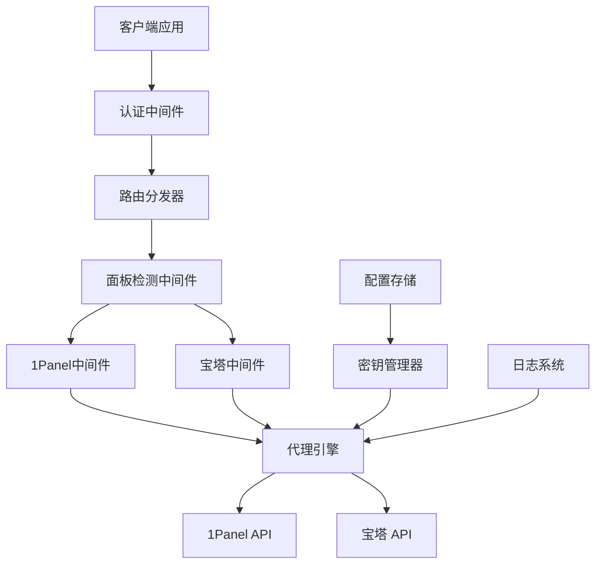
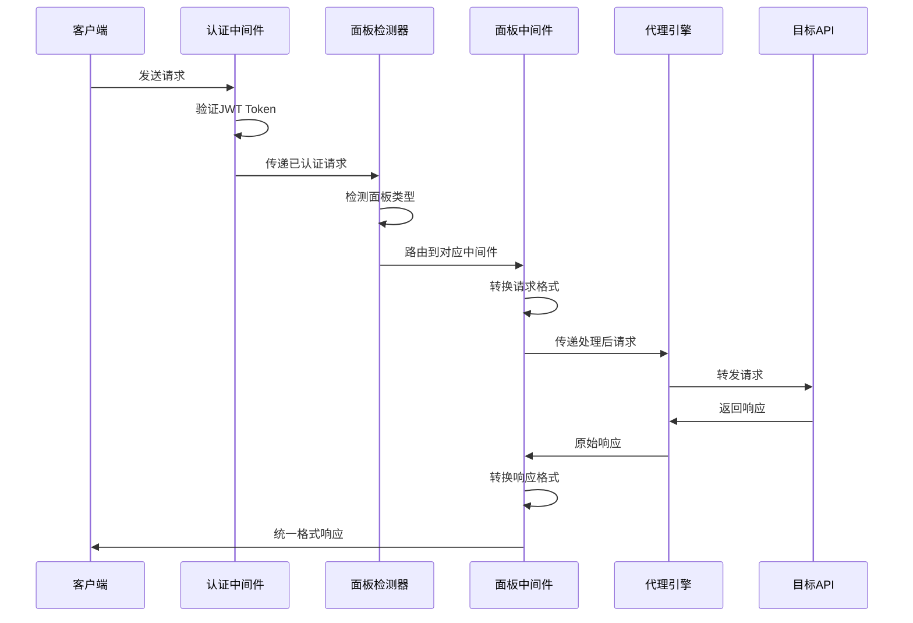
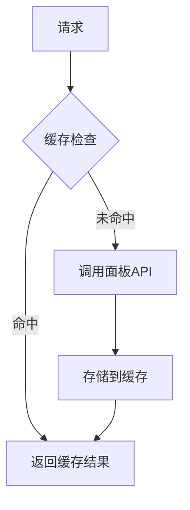

# Node API代理服务设计文档

## 概述

本项目旨在构建一个基于Node.js的API代理服务，用于代理用户提供的API和密钥，访问不同的面板接口（1Panel和宝塔面板），并通过中间件机制实现面板类型的智能识别和路由分发。

### 核心功能

- API代理服务：转发用户请求到目标面板API
- 密钥管理：安全存储和管理用户API密钥
- 面板识别：自动识别1Panel和宝塔面板
- 中间件架构：模块化处理不同面板的请求格式

### 技术栈

- **运行时**: Node.js (v18+)
- **框架**: Express.js
- **安全**: JWT认证、加密存储
- **数据库**: SQLite/Redis（密钥存储）
- **日志**: Winston
- **测试**: Jest

## 架构设计

### 系统架构图



### 核心模块

#### 1. 认证模块 (Auth Module)

```typescript
interface AuthConfig {
	jwtSecret: string
	tokenExpiry: string
	rateLimiting: {
		windowMs: number
		maxRequests: number
	}
}

interface UserCredentials {
	userId: string
	apiKey: string
	panelType: 'onePanel' | 'baota'
	endpoint: string
}
```

#### 2. 面板检测中间件 (Panel Detection Middleware)

```typescript
interface PanelDetectionResult {
	panelType: 'onePanel' | 'baota' | 'unknown'
	version?: string
	capabilities: string[]
}

interface DetectionStrategy {
	detect(endpoint: string, headers: Record<string, string>): Promise<PanelDetectionResult>
}
```

#### 3. 代理引擎 (Proxy Engine)

```typescript
interface ProxyRequest {
	originalUrl: string
	method: string
	headers: Record<string, string>
	body: any
	panelType: string
	userCredentials: UserCredentials
}

interface ProxyResponse {
	statusCode: number
	headers: Record<string, string>
	body: any
	processingTime: number
}
```

## API设计

### 认证端点

| 端点             | 方法 | 描述      | 请求体                        |
| ---------------- | ---- | --------- | ----------------------------- |
| `/auth/login`    | POST | 用户登录  | `{username, password}`        |
| `/auth/register` | POST | 用户注册  | `{username, password, email}` |
| `/auth/refresh`  | POST | 刷新token | `{refreshToken}`              |

### 配置管理端点

| 端点                 | 方法   | 描述             | 请求体                                |
| -------------------- | ------ | ---------------- | ------------------------------------- |
| `/config/panels`     | GET    | 获取面板配置列表 | -                                     |
| `/config/panels`     | POST   | 添加面板配置     | `{name, endpoint, apiKey, panelType}` |
| `/config/panels/:id` | PUT    | 更新面板配置     | `{name, endpoint, apiKey}`            |
| `/config/panels/:id` | DELETE | 删除面板配置     | -                                     |

### 代理端点

| 端点                | 方法 | 描述                   |
| ------------------- | ---- | ---------------------- |
| `/proxy/:panelId/*` | ALL  | 代理所有请求到指定面板 |
| `/proxy/auto/*`     | ALL  | 自动检测面板类型并代理 |

## 中间件架构

### 请求处理流程



### 1Panel中间件特性

```typescript
class OnePanelMiddleware {
	// 请求头处理
	private processHeaders(headers: Record<string, string>): Record<string, string> {
		return {
			...headers,
			Authorization: `Bearer ${this.apiKey}`,
			'Content-Type': 'application/json',
		}
	}

	// API路径映射
	private mapApiPath(originalPath: string): string {
		const pathMappings = {
			'/containers': '/api/v1/containers',
			'/images': '/api/v1/images',
			'/system/info': '/api/v1/system/info',
		}
		return pathMappings[originalPath] || originalPath
	}
}
```

### 宝塔中间件特性

```typescript
class BaotaMiddleware {
	// 请求签名
	private signRequest(data: any): string {
		const timestamp = Date.now()
		const signature = crypto
			.createHmac('sha256', this.secretKey)
			.update(`${timestamp}${JSON.stringify(data)}`)
			.digest('hex')
		return signature
	}

	// 响应格式转换
	private transformResponse(btResponse: any): any {
		return {
			success: btResponse.status === true,
			data: btResponse.data || btResponse.msg,
			message: btResponse.msg,
			code: btResponse.status ? 200 : 400,
		}
	}
}
```

## 数据模型

### 用户配置表

| 字段          | 类型         | 描述     | 约束                      |
| ------------- | ------------ | -------- | ------------------------- |
| id            | INTEGER      | 主键     | PRIMARY KEY               |
| user_id       | VARCHAR(50)  | 用户ID   | NOT NULL, UNIQUE          |
| username      | VARCHAR(100) | 用户名   | NOT NULL                  |
| password_hash | VARCHAR(255) | 密码哈希 | NOT NULL                  |
| created_at    | TIMESTAMP    | 创建时间 | DEFAULT CURRENT_TIMESTAMP |
| updated_at    | TIMESTAMP    | 更新时间 | DEFAULT CURRENT_TIMESTAMP |

### 面板配置表

| 字段              | 类型         | 描述          | 约束                      |
| ----------------- | ------------ | ------------- | ------------------------- |
| id                | INTEGER      | 主键          | PRIMARY KEY               |
| user_id           | VARCHAR(50)  | 所属用户      | FOREIGN KEY               |
| name              | VARCHAR(100) | 配置名称      | NOT NULL                  |
| panel_type        | VARCHAR(20)  | 面板类型      | NOT NULL                  |
| endpoint          | VARCHAR(255) | API端点       | NOT NULL                  |
| api_key_encrypted | TEXT         | 加密的API密钥 | NOT NULL                  |
| is_active         | BOOLEAN      | 是否启用      | DEFAULT TRUE              |
| created_at        | TIMESTAMP    | 创建时间      | DEFAULT CURRENT_TIMESTAMP |

## 安全设计

### 密钥管理策略


### 安全特性

1. **密钥加密存储**
   - 使用AES-256-GCM加密算法
   - 每个密钥使用唯一的初始化向量(IV)
   - 主加密密钥通过环境变量管理

2. **请求验证**
   - JWT Token认证
   - 请求签名验证
   - 访问频率限制

3. **数据传输安全**
   - 强制HTTPS通信
   - 请求/响应数据加密
   - 敏感信息脱敏日志

## 配置管理

### 环境配置

```typescript
interface ServerConfig {
	port: number
	host: string
	cors: {
		origin: string[]
		credentials: boolean
	}
	encryption: {
		masterKey: string
		algorithm: string
	}
	database: {
		type: 'sqlite' | 'mysql' | 'postgresql'
		connectionString: string
	}
	logging: {
		level: 'debug' | 'info' | 'warn' | 'error'
		file: string
	}
}
```

### 面板特定配置

```typescript
interface PanelConfig {
	onePanel: {
		defaultTimeout: number
		retryAttempts: number
		pathPrefix: string
		supportedVersions: string[]
	}
	baota: {
		defaultTimeout: number
		signatureRequired: boolean
		pathPrefix: string
		supportedVersions: string[]
	}
}
```

## 错误处理

### 错误分类体系

```typescript
enum ErrorCategory {
	AUTHENTICATION = 'AUTH',
	AUTHORIZATION = 'AUTHZ',
	VALIDATION = 'VALIDATION',
	PANEL_CONNECTION = 'PANEL_CONN',
	PROXY_ERROR = 'PROXY',
	INTERNAL = 'INTERNAL',
}

interface ApiError {
	code: string
	category: ErrorCategory
	message: string
	details?: any
	timestamp: string
	requestId: string
}
```

### 错误响应格式

```json
{
	"success": false,
	"error": {
		"code": "PANEL_CONN_001",
		"category": "PANEL_CONN",
		"message": "无法连接到目标面板",
		"details": {
			"endpoint": "https://panel.example.com",
			"timeout": 5000
		},
		"timestamp": "2024-01-15T10:30:00Z",
		"requestId": "req_123456789"
	}
}
```

## 性能优化

### 缓存策略



### 优化措施

1. **连接池管理**
   - HTTP客户端连接复用
   - 面板连接池配置
   - 连接超时和重试机制

2. **响应缓存**
   - Redis缓存热点数据
   - 可配置的缓存过期时间
   - 缓存失效策略

3. **请求优化**
   - 批量请求合并
   - 并发请求限制
   - 负载均衡支持

## 监控与日志

### 日志级别设计

| 级别  | 用途     | 示例                     |
| ----- | -------- | ------------------------ |
| DEBUG | 调试信息 | 请求参数、中间件执行流程 |
| INFO  | 一般信息 | 请求成功、配置加载       |
| WARN  | 警告信息 | 响应时间过长、重试触发   |
| ERROR | 错误信息 | 连接失败、认证错误       |

### 监控指标

```typescript
interface Metrics {
	requests: {
		total: number
		success: number
		failed: number
		averageResponseTime: number
	}
	panels: {
		onePanel: PanelMetrics
		baota: PanelMetrics
	}
	security: {
		authFailures: number
		rateLimitHits: number
	}
}

interface PanelMetrics {
	totalRequests: number
	errorRate: number
	averageLatency: number
	lastHealthCheck: string
}
```

## 测试策略

### 测试层次

1. **单元测试**
   - 中间件逻辑测试
   - 工具函数测试
   - 数据模型验证

2. **集成测试**
   - API端点测试
   - 数据库操作测试
   - 外部服务模拟

3. **端到端测试**
   - 完整代理流程测试
   - 面板兼容性测试
   - 安全功能验证

### 测试覆盖率目标

| 模块         | 目标覆盖率 |
| ------------ | ---------- |
| 核心业务逻辑 | >90%       |
| API接口      | >85%       |
| 工具函数     | >95%       |
| 总体覆盖率   | >85%       |
