# Vue 桌面应用设计文档

## 概述

基于玲珑OS现有的Monorepo架构，设计并实现一个现代化的Vue 3桌面风格应用。该应用集成登录系统、可拖拽的桌面Grid布局、窗口管理等核心功能，为用户提供类原生操作系统的Web体验。

## 技术栈与依赖

### 核心技术栈
- **前端框架**: Vue 3 (Composition API)
- **类型系统**: TypeScript 5.0+
- **状态管理**: Pinia
- **路由管理**: Vue Router 4
- **拖拽功能**: Vue DnD / @vueuse/core
- **UI组件库**: shadcn-vue
- **样式方案**: Tailwind CSS + UnoCSS
- **构建工具**: Vite
- **包管理**: pnpm (workspace)

### 项目架构模式
- **Monorepo架构**: 基于现有的pnpm workspace
- **模块化设计**: 按功能域划分模块
- **事件驱动**: 组件间低耦合通信
- **依赖注入**: 统一的服务容器管理

## 应用架构

### 目录结构设计

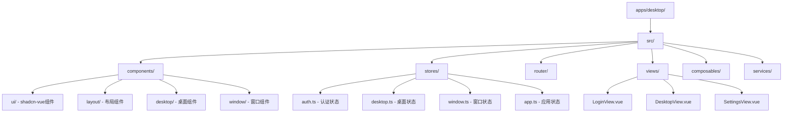

### 核心模块架构

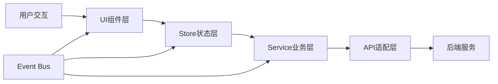

## 组件架构

### 桌面系统组件

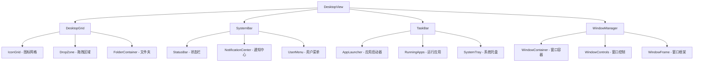

### 窗口系统架构

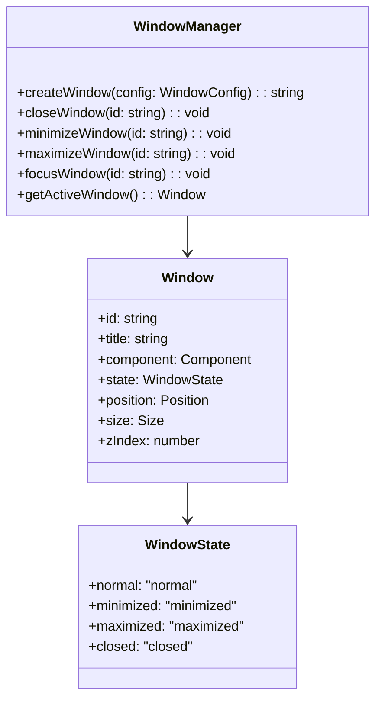

### 拖拽系统设计

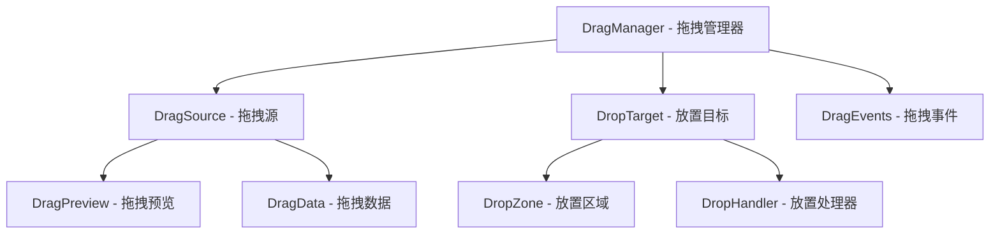

## 状态管理设计

### Pinia Store架构

```typescript
// 认证状态管理
interface AuthStore {
  user: User | null
  isAuthenticated: boolean
  token: string | null
  permissions: Permission[]
  
  login(credentials: LoginCredentials): Promise<void>
  logout(): Promise<void>
  refreshToken(): Promise<void>
  checkPermission(permission: string): boolean
}

// 桌面状态管理  
interface DesktopStore {
  icons: DesktopIcon[]
  grid: GridConfig
  wallpaper: WallpaperConfig
  theme: ThemeConfig
  
  addIcon(icon: DesktopIcon): void
  removeIcon(iconId: string): void
  updateIconPosition(iconId: string, position: Position): void
  createFolder(icons: string[]): void
}

// 窗口状态管理
interface WindowStore {
  windows: Map<string, Window>
  activeWindowId: string | null
  zIndexCounter: number
  
  createWindow(config: WindowConfig): string
  updateWindow(id: string, updates: Partial<Window>): void
  closeWindow(id: string): void
  setActiveWindow(id: string): void
}
```

### 状态数据流

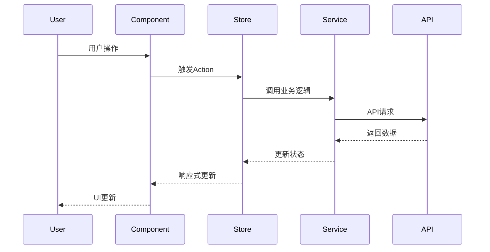

## 路由架构

### 路由配置

```typescript
interface RouteConfig {
  path: string
  component: Component
  meta: RouteMeta
  children?: RouteConfig[]
}

interface RouteMeta {
  requiresAuth: boolean
  permissions?: string[]
  title?: string
  layout?: string
}

const routes: RouteConfig[] = [
  {
    path: '/login',
    component: () => import('@/views/LoginView.vue'),
    meta: { requiresAuth: false, title: '登录' }
  },
  {
    path: '/',
    component: () => import('@/views/DesktopView.vue'),
    meta: { requiresAuth: true, title: '桌面' },
    children: [
      {
        path: 'settings',
        component: () => import('@/views/SettingsView.vue'),
        meta: { requiresAuth: true, title: '设置' }
      }
    ]
  }
]
```

### 导航守卫

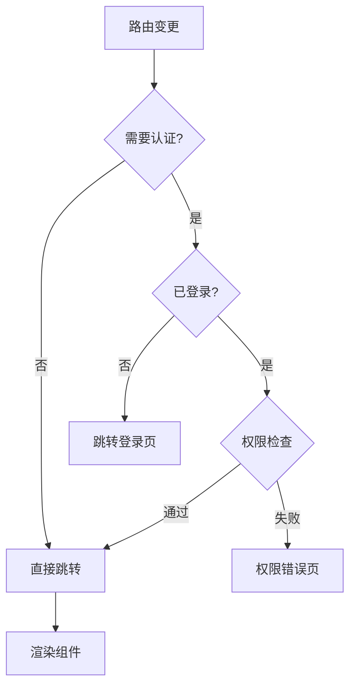

## UI组件设计

### shadcn-vue集成

```typescript
// 基础组件封装
interface ButtonProps {
  variant: 'default' | 'destructive' | 'outline' | 'secondary' | 'ghost' | 'link'
  size: 'default' | 'sm' | 'lg' | 'icon'
  disabled?: boolean
  loading?: boolean
}

interface ModalProps {
  visible: boolean
  title?: string
  width?: string | number
  closable?: boolean
  maskClosable?: boolean
  destroyOnClose?: boolean
}

interface TableProps {
  data: any[]
  columns: TableColumn[]
  loading?: boolean
  pagination?: PaginationConfig
  rowSelection?: RowSelection
}
```

### 桌面专用组件

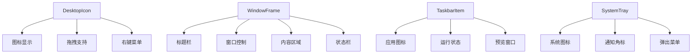

### 组件通信模式

```typescript
// 事件总线类型定义
interface EventMap {
  'window:created': { windowId: string; config: WindowConfig }
  'window:closed': { windowId: string }
  'icon:moved': { iconId: string; position: Position }
  'app:launched': { appId: string; windowId: string }
  'notification:show': { notification: Notification }
}

// 组件间通信
class EventBus {
  emit<K extends keyof EventMap>(event: K, data: EventMap[K]): void
  on<K extends keyof EventMap>(event: K, handler: (data: EventMap[K]) => void): void
  off<K extends keyof EventMap>(event: K, handler: Function): void
}
```

## 拖拽功能实现

### 拖拽核心架构

```typescript
interface DragConfig {
  type: 'icon' | 'window' | 'file'
  data: any
  preview?: HTMLElement
  effectAllowed: 'move' | 'copy' | 'link'
}

interface DropConfig {
  accept: string[]
  effect: 'move' | 'copy' | 'link'
  onDrop: (data: any) => void
  onDragEnter?: () => void
  onDragLeave?: () => void
}

class DragManager {
  startDrag(element: HTMLElement, config: DragConfig): void
  createDropZone(element: HTMLElement, config: DropConfig): void
  getCurrentDrag(): DragConfig | null
  isDragging(): boolean
}
```

### 拖拽交互流程

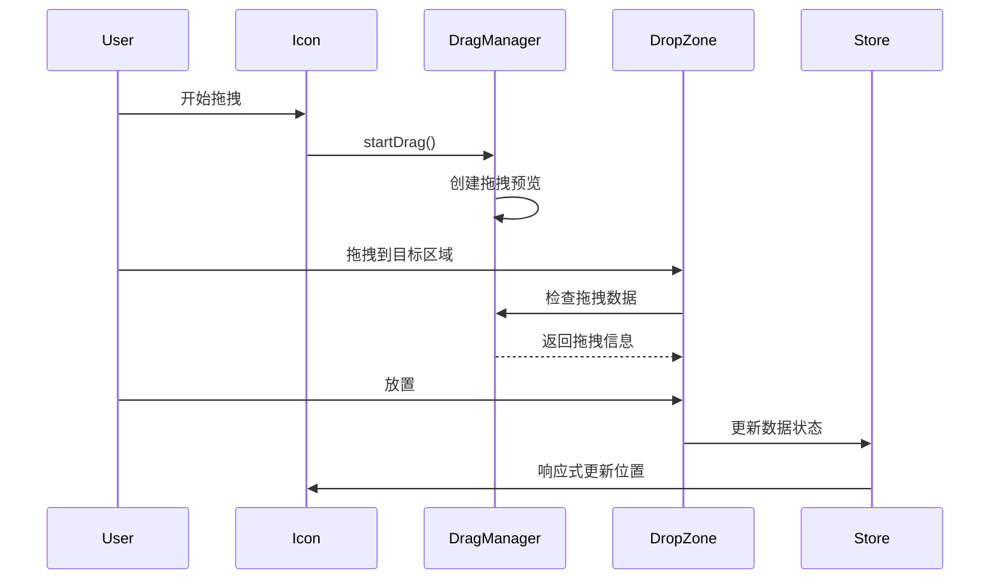

### 网格布局算法

```typescript
interface GridPosition {
  x: number
  y: number
  width: number
  height: number
}

interface GridConfig {
  columns: number
  rows: number
  cellWidth: number
  cellHeight: number
  gap: number
}

class GridLayoutManager {
  findNearestPosition(mousePos: Point, config: GridConfig): GridPosition
  isPositionOccupied(position: GridPosition, icons: DesktopIcon[]): boolean
  getAvailablePositions(config: GridConfig, icons: DesktopIcon[]): GridPosition[]
  optimizeLayout(icons: DesktopIcon[], config: GridConfig): DesktopIcon[]
}
```

## 业务功能设计

### 登录系统

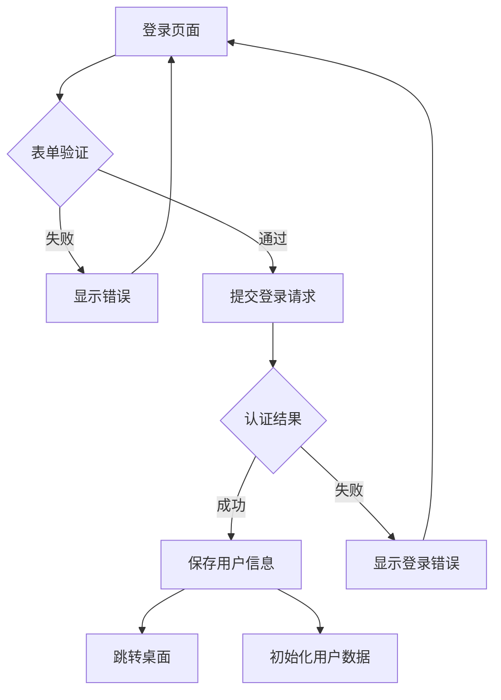

### 桌面管理

```typescript
interface DesktopManager {
  // 图标管理
  addIcon(icon: DesktopIcon): void
  removeIcon(iconId: string): void
  moveIcon(iconId: string, position: Position): void
  
  // 文件夹管理
  createFolder(iconIds: string[], name: string): void
  openFolder(folderId: string): void
  addToFolder(folderId: string, iconId: string): void
  
  // 布局管理
  autoArrange(): void
  resetLayout(): void
  saveLayout(): void
  loadLayout(): void
  
  // 主题管理
  setWallpaper(wallpaper: WallpaperConfig): void
  setTheme(theme: ThemeConfig): void
}
```

### 窗口管理

```typescript
interface WindowManagerService {
  // 窗口生命周期
  createWindow(config: WindowConfig): Promise<string>
  closeWindow(id: string): Promise<void>
  minimizeWindow(id: string): void
  maximizeWindow(id: string): void
  restoreWindow(id: string): void
  
  // 窗口操作
  moveWindow(id: string, position: Position): void
  resizeWindow(id: string, size: Size): void
  setWindowTitle(id: string, title: string): void
  
  // 窗口状态
  getActiveWindow(): Window | null
  getAllWindows(): Window[]
  getWindowById(id: string): Window | null
  
  // 焦点管理
  focusWindow(id: string): void
  getWindowZOrder(): string[]
  bringToFront(id: string): void
}
```

## 数据模型

### 核心数据结构

```typescript
interface User {
  id: string
  username: string
  email: string
  avatar?: string
  preferences: UserPreferences
  permissions: Permission[]
}

interface DesktopIcon {
  id: string
  type: 'app' | 'file' | 'folder'
  name: string
  icon: string
  position: GridPosition
  appId?: string
  filePath?: string
  children?: string[] // for folders
}

interface Window {
  id: string
  title: string
  component: string
  props?: Record<string, any>
  state: WindowState
  position: Position
  size: Size
  zIndex: number
  resizable: boolean
  maximizable: boolean
  minimizable: boolean
}

interface AppDefinition {
  id: string
  name: string
  icon: string
  component: string
  category: string
  description: string
  permissions: string[]
  config?: Record<string, any>
}
```

### 配置管理

```typescript
interface SystemConfig {
  desktop: DesktopConfig
  theme: ThemeConfig
  security: SecurityConfig
  performance: PerformanceConfig
}

interface DesktopConfig {
  grid: GridConfig
  wallpaper: WallpaperConfig
  icons: IconConfig
  animations: AnimationConfig
}

interface ThemeConfig {
  mode: 'light' | 'dark' | 'auto'
  primaryColor: string
  accentColor: string
  fontFamily: string
  borderRadius: number
}
```

## 性能优化

### 组件级优化

```typescript
// 虚拟滚动
interface VirtualScrollConfig {
  itemHeight: number
  bufferSize: number
  overscan: number
}

// 懒加载
const LazyComponent = defineAsyncComponent({
  loader: () => import('./HeavyComponent.vue'),
  loading: LoadingComponent,
  error: ErrorComponent,
  delay: 200,
  timeout: 3000
})

// 防抖优化
import { debounce } from '@vueuse/core'

const debouncedSearch = debounce((query: string) => {
  // 搜索逻辑
}, 300)
```

### 状态优化

```typescript
// Store分片
interface StoreModule {
  desktop: DesktopStore
  window: WindowStore
  auth: AuthStore
  app: AppStore
}

// 持久化配置
interface PersistConfig {
  key: string
  storage: 'localStorage' | 'sessionStorage'
  paths: string[]
  beforeRestore?: (context: any) => void
  afterRestore?: (context: any) => void
}
```

### 渲染优化

```typescript
// 窗口虚拟化
interface WindowVirtualization {
  visibleWindows: Set<string>
  offscreenWindows: Set<string>
  updateVisibility(): void
  renderWindow(id: string): void
  hideWindow(id: string): void
}

// 图标网格优化
interface IconGridOptimization {
  visibleIcons: DesktopIcon[]
  viewportBounds: Bounds
  updateViewport(bounds: Bounds): void
  getVisibleIcons(): DesktopIcon[]
}
```

## 安全策略

### 认证与授权

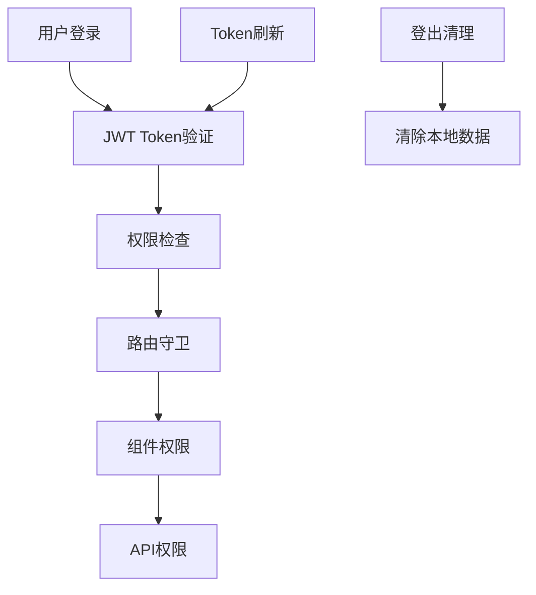

### 输入验证

```typescript
interface ValidationRule {
  required?: boolean
  minLength?: number
  maxLength?: number
  pattern?: RegExp
  custom?: (value: any) => boolean | string
}

interface FormValidation {
  rules: Record<string, ValidationRule[]>
  validate(data: Record<string, any>): ValidationResult
  validateField(field: string, value: any): string[]
}
```

## 测试策略

### 单元测试

```typescript
// 组件测试
describe('DesktopIcon', () => {
  it('should render icon correctly', () => {
    const wrapper = mount(DesktopIcon, {
      props: { icon: mockIcon }
    })
    expect(wrapper.find('.icon').exists()).toBe(true)
  })
  
  it('should handle drag events', async () => {
    const wrapper = mount(DesktopIcon, {
      props: { icon: mockIcon }
    })
    await wrapper.trigger('dragstart')
    expect(wrapper.emitted('drag-start')).toBeTruthy()
  })
})

// Store测试
describe('DesktopStore', () => {
  it('should add icon to desktop', () => {
    const store = useDesktopStore()
    store.addIcon(mockIcon)
    expect(store.icons).toContain(mockIcon)
  })
})
```

### 集成测试

```typescript
// E2E测试场景
describe('Desktop Application', () => {
  it('should complete login flow', () => {
    cy.visit('/login')
    cy.get('[data-testid=username]').type('testuser')
    cy.get('[data-testid=password]').type('password')
    cy.get('[data-testid=login-btn]').click()
    cy.url().should('include', '/')
  })
  
  it('should create and manage windows', () => {
    cy.get('[data-testid=app-icon]').dblclick()
    cy.get('[data-testid=window]').should('be.visible')
    cy.get('[data-testid=close-btn]').click()
    cy.get('[data-testid=window]').should('not.exist')
  })
})
```