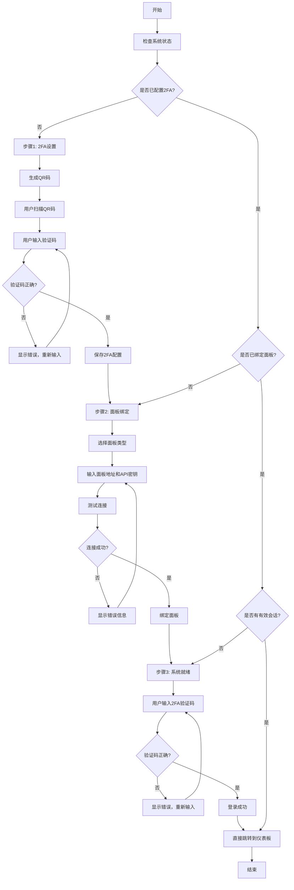

# LinglongOS 系统初始化业务流程文档

## 概述

LinglongOS 系统初始化是一个三步骤的向导流程，用于完成系统的首次配置。该流程包括双因子认证设置、面板绑定和最终登录验证。

## 业务流程图



## 详细业务流程

### 1. 系统状态检查

**触发时机**: 页面加载时

**业务逻辑**:
- 调用 `/api/v1/init/status` 接口检查系统当前状态
- 根据返回的状态决定显示哪个步骤：
  - `hasTwoFA: false` → 显示2FA设置步骤
  - `hasTwoFA: true, hasPanel: false` → 显示面板绑定步骤
  - `hasTwoFA: true, hasPanel: true, hasValidSession: false` → 显示登录步骤
  - `hasTwoFA: true, hasPanel: true, hasValidSession: true` → 直接跳转到仪表板

### 2. 步骤1: 双因子认证设置

**目标**: 为系统配置TOTP双因子认证

**业务流程**:
1. **生成QR码**
   - 调用 `/api/v1/auth/google-auth-bind` 获取TOTP密钥和QR码URL
   - 使用第三方服务生成QR码图片
   - 启动10分钟倒计时，到期自动刷新QR码

2. **用户扫描配置**
   - 用户使用Google Authenticator等TOTP应用扫描QR码
   - 应用会生成6位数字验证码

3. **验证绑定**
   - 用户输入6位验证码
   - 调用 `/api/v1/auth/google-auth-confirm` 验证并保存配置
   - 验证成功后自动进入下一步骤

**状态管理**:
- 使用localStorage保存当前步骤和QR密钥
- 支持页面刷新后恢复状态（1小时内有效）

### 3. 步骤2: 面板绑定设置

**目标**: 绑定外部管理面板（宝塔面板、1Panel、aaPanel）

**业务流程**:
1. **选择面板类型**
   - 支持的面板类型：
     - 宝塔面板 (bt)
     - 1Panel (1panel)
     - aaPanel (aaPanel)

2. **配置连接信息**
   - 面板地址：完整的URL地址
   - API密钥：面板提供的API访问密钥

3. **测试连接**
   - 可选步骤，验证配置的正确性
   - 模拟连接测试（当前为演示实现）

4. **绑定面板**
   - 调用 `/api/v1/proxy/bind-panel-key` 保存面板配置
   - 绑定成功后自动进入下一步骤

**验证规则**:
- 面板地址必须是有效的URL格式
- API密钥不能为空
- 输入错误时会高亮显示错误字段

### 4. 步骤3: 系统就绪

**目标**: 使用2FA验证码完成最终登录

**业务流程**:
1. **输入验证码**
   - 用户从TOTP应用获取当前6位验证码
   - 支持粘贴操作，自动分割到各个输入框

2. **登录验证**
   - 调用 `/api/v1/auth/google-auth-verify` 验证当前验证码
   - 验证成功后跳转到仪表板页面

**用户体验**:
- 自动焦点跳转
- 输入错误时震动动画提示
- 支持退格键回退到上一个输入框

## 状态持久化

### 本地存储策略
- **存储键**: `linglongos_setup_state`
- **存储内容**:
  ```json
  {
    "currentStep": 0,
    "systemStatus": {},
    "qrSecret": "XXXXX",
    "timestamp": 1234567890
  }
  ```
- **过期策略**: 1小时后自动清除
- **恢复逻辑**: 页面加载时检查并恢复有效状态

### 服务端状态
- 通过API接口维护系统配置状态
- 支持多次访问时的状态一致性
- 配置完成后的持久化存储

## 错误处理

### 网络错误
- 自动重试机制
- 友好的错误提示信息
- 保持用户输入状态

### 验证错误
- 实时输入验证
- 视觉错误反馈（红色边框、震动动画）
- 清晰的错误消息提示

### 超时处理
- QR码10分钟自动刷新
- 会话超时自动重新开始流程

## 安全考虑

### 2FA安全
- TOTP密钥安全生成
- 验证码一次性使用
- 密钥传输加密

### API安全
- 所有请求包含认证信息
- 敏感操作需要验证
- 防止CSRF攻击

### 数据保护
- 本地存储加密
- 敏感信息不在前端长期保存
- 安全的状态清理机制